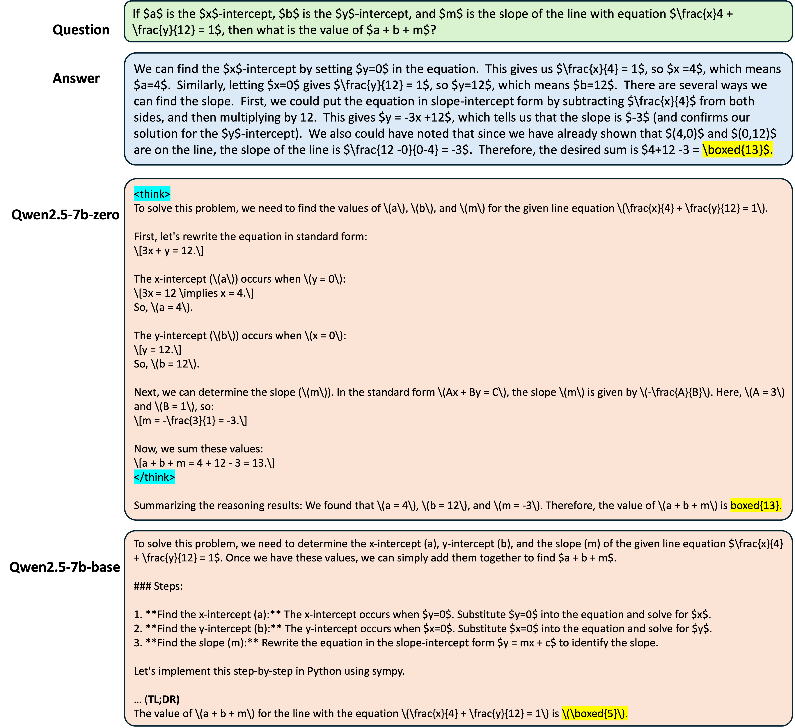
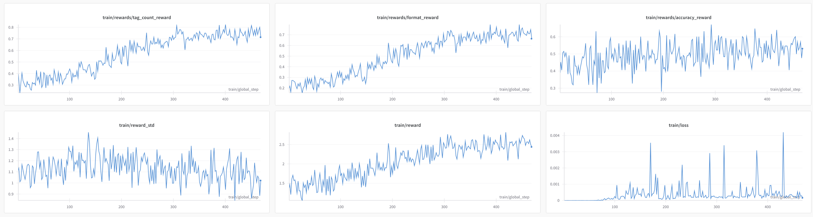

# zero-simple-reproduction
This project is a simple reproduction of deepseek-zero. And we utilized the Qwen2.5 LLM as the primary LLM.

This projest mainly refers to the [openr1](https://github.com/huggingface/open-r1/tree/main).

The Qwen2.5-7b-zero is obtained through grpo training on the train dataset of [MATH-lighteval](https://huggingface.co/datasets/DigitalLearningGmbH/MATH-lighteval) using Qwen2.5-7b-base. And we used lora instead of full-training. The examples of Qwen2.5-7b-zero and Qwen2.5-7b-base are shown in the following figure.
<center>
    
</center>


The curves of loss and reward throughout the entire training process are shown in the following figure.
<center>
    
</center>

### Environment
```shell
conda creat zero -n zero python=3.10
    
conda activate zero

pip install -r requirements.txt
```


### Train
Run this to training:
```shell
ACCELERATE_LOG_LEVEL=info accelerate launch --config_file recipes/accelerate_configs/zero2.yaml \
    --num_processes=1 src/open_r1/grpo.py \
    --config recipes/grpo/config_simple_rl.yaml \
    --vllm_gpu_memory_utilization 0.5 \
    --vllm_device 'cuda:0' \
    --use_peft \
    --lora_target_modules q_proj,k_proj,v_proj,o_proj \
    --wandb_project 'openr1_grpo-7b-base' \
    
```


### Test
Run this to generate:
```shell
CUDA_VISIBLE_DEVICES=0 python test_generate.py \
  --model_path 'base_model_path' \
  --lora_path 'lora_adapter_path' \
  --data_path 'data_path' \
  
```
